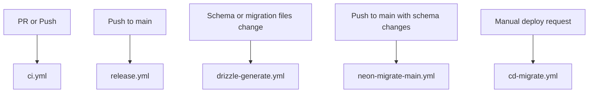

# GitHub Actions Workflows

This directory contains GitHub Actions workflows for CI, npm releases, and Neon-backed database migrations.

## Workflows Overview

### 🔄 Continuous Integration

#### `ci.yml` - Continuous Integration
**Trigger**: Every pull request and pushes to `main`/`develop`

**What it does**:
- Verifies all database migrations are committed
- Runs schema validation checks
- Performs type checking across the monorepo
- Runs ESLint with zero warnings
- Executes the test suite

**Required for**: PR merge and branch protection

---

### 📦 Releases

#### `release.yml` - Changesets Release Flow
**Trigger**:
- Pushes to `main`
- Manual `workflow_dispatch` for the one-time bootstrap publish

**What it does**:
- Opens or updates a release PR from pending changesets
- Publishes packages to npm when the release PR is merged
- Keeps version bumps and changelogs in git instead of publishing directly from normal CI
- Uses npm Trusted Publishing via GitHub Actions OIDC
- Supports a one-time manual bootstrap publish of the current checked-in versions

**Use it for**:
- The initial `0.1.0` bootstrap publish via manual dispatch with `bootstrap=true`
- Ongoing package releases after that via normal Changesets release PRs

**Setup required**:
- Configure npm Trusted Publishing for this GitHub repository and workflow filename
- Use GitHub-hosted runners

---

### 🚀 Production Deployment

#### `cd-migrate.yml` - Production Database Migrations
**Trigger**: Manual workflow dispatch

**Parameters**:
- `environment`: `staging` or `production`

**What it does**:
- Migrates the database using Drizzle

**Usage**:
```bash
gh workflow run cd-migrate.yml -f environment=production
```

---

#### `neon-migrate-main.yml` - Auto Migrate on `main`
**Trigger**: Pushes to `main` that touch database schemas or migrations. Can also be run manually.

**What it does**:
- Installs dependencies
- Runs migrations using production DATABASE_URL
- Emits a summary of the migration

**Use it when**:
- Schema or migration changes are merged into `main`
- You need to replay migrations from `main` via `workflow_dispatch`

**Important**: This workflow expects `DATABASE_URL` to be configured as a GitHub secret.

---

### 🛠️ Database Maintenance

#### `drizzle-generate.yml` - Drizzle Generation Check
**Trigger**: Changes to package schemas, template Drizzle configs, or committed template migrations

**What it does**:
- Runs Drizzle generation for the DMC and operator templates
- Fails if generated files differ from committed files
- Ensures developers commit migrations with schema changes

**Fix if failing**:
```bash
pnpm db:generate
pnpm -F operator db:generate
git add templates/dmc/migrations templates/operator/migrations
git commit -m "chore: add missing migrations"
```

---

## Database Architecture

Voyant composes shared package schemas into template-owned Drizzle configs and migrations:

```
packages/
├── db/                     # Core IAM + infra schema exports and DB runtime
├── */src/schema*.ts        # Module schemas and schema extensions
templates/
├── dmc/drizzle.config.ts
├── dmc/migrations/
├── operator/drizzle.config.ts
└── operator/migrations/
```

## Required GitHub Secrets

```bash
DATABASE_URL    # Neon database connection string
```

## Workflow Dependencies



## Best Practices

### For Developers

1. **Always commit migrations with schema changes**
   ```bash
   pnpm db:generate
   pnpm -F operator db:generate
   git add templates/dmc/migrations templates/operator/migrations
   git commit -m "feat: add new schema"
   ```

2. **Wait for `ci.yml` to finish** before requesting reviews or merging

3. **Test migrations locally or in staging**

4. **Communicate risky migrations early** so the platform team can plan production rollout windows

### For DevOps

1. **Monitor Neon console** for compute usage after migrations

2. **Use `neon-migrate-main.yml`** for automatic production updates and `cd-migrate.yml` for manual/emergency runs

3. **Verify migrations in staging** before triggering production workflows

## Monitoring

### Workflow Status
```bash
# List recent CI workflow runs
gh run list --workflow=ci.yml

# Watch Neon production migration workflow
gh run list --workflow=neon-migrate-main.yml
```

### Migration Status
```bash
# Check applied migrations
psql $DATABASE_URL -c "SELECT * FROM drizzle_migrations ORDER BY id DESC LIMIT 10"
```

## Troubleshooting

### CI flags uncommitted migrations

**Cause**: Schema files changed without running `pnpm db:generate`

**Fix**:
1. Run `pnpm db:generate`
2. Commit generated migrations
3. Rerun the CI workflow

## Security

- ✅ Never log database URLs (contain credentials)
- ✅ Use GitHub secrets for all sensitive data
- ✅ Rotate database credentials periodically
- ✅ Use environment protection rules for production

## Additional Resources

- [Neon GitHub Integration Docs](https://neon.tech/docs/guides/neon-github-integration)
- [Drizzle Migrations](https://orm.drizzle.team/docs/migrations)
